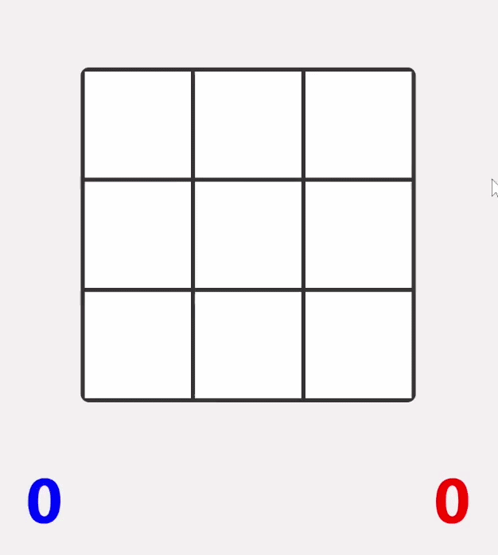

# TIC-TAC-TOE

A simple classic two-player tic-tac-toe game made using HTML, CSS, and vanilla JavaScript (JS).

## 👀Preview

## 🚀Live demo

[Play Here](https://guie-torres.github.io/tic-tac-toe/)

## 🎮How to play

- Players take turns clicking empty cells on the grid
- Clicked cells fill with the current player's color (Blue/Red)
- When a player completes a row, column, or diagonal, they win
- In case no player manages to win, the game ends in a draw
- Wins are tracked below the grid
- After the game ends (a player wins or a draw occurs), the game resets after a short wait

## 💫Features

- Two-player local gameplay
- Victory condition detection
- Draw detection
- Automatic board reset
- Score tracker

## ⚒️Technology

- HTML5
- CSS3
- JavaScript (vanilla, no frameworks)

## 🚀Running the Project

Clone or download this repository, then open `index.html` in any modern web browser.

git clone https://github.com/guie-torres/tic-tac-toe.git
cd tic-tac-toe

open index.html

## 🎯Purpose

The main purpose of this project was to refresh my HTML, CSS, and JS fundamentals. I used Cursor to create the initial grid, then wrote the rest of the game logic manually to reinforce those fundamentals.

## 🔮Future Improvements

- Add an AI opponent
- Improve UI
- Increase grid size
- Change starting color
